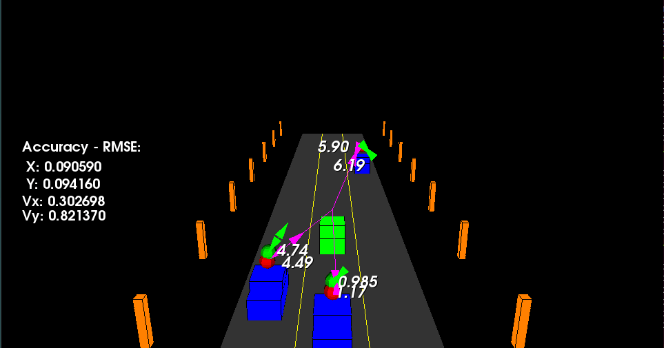

# Unscented Kalman Filter

This is the final project of Udacity's Sensor Fusion Nanodegree program.

In this project I have implemented a standard **unscented kalman filter** to filter and fuse the data from a lidar and a radar sensor. If only takes data from these two sensors since the sensor model coded contain only these two models. New sensor model will have to be added in future attempts

**The following gif is the result of my first implementation**

Here the Unscented Kalman Filter is used to estimate the state of multiple cars on a highway using noisy lidar and radar measurements. 

The main program can be built and run by doing the following from the project top directory.

1. mkdir build
2. cd build
3. cmake ..
4. make
5. ./ukf_highway

The red spheres above cars represent the (x,y) lidar detection and the purple lines show the radar measurements with the velocity magnitude along the detected angle. The Z axis is not taken into account for tracking, so we are only tracking along the X/Y axis.

---

## Other Important Dependencies
* cmake >= 3.5
  * All OSes: [click here for installation instructions](https://cmake.org/install/)
* make >= 4.1 (Linux, Mac), 3.81 (Windows)
  * Linux: make is installed by default on most Linux distros
  * Mac: [install Xcode command line tools to get make](https://developer.apple.com/xcode/features/)
  * Windows: [Click here for installation instructions](http://gnuwin32.sourceforge.net/packages/make.htm)
* gcc/g++ >= 5.4
  * Linux: gcc / g++ is installed by default on most Linux distros
  * Mac: same deal as make - [install Xcode command line tools](https://developer.apple.com/xcode/features/)
  * Windows: recommend using [MinGW](http://www.mingw.org/)
 * PCL 1.2

## Basic Build Instructions

1. Clone this repo.
2. Make a build directory: `mkdir build && cd build`
3. Compile: `cmake .. && make`
4. Run it: `./ukf_highway`